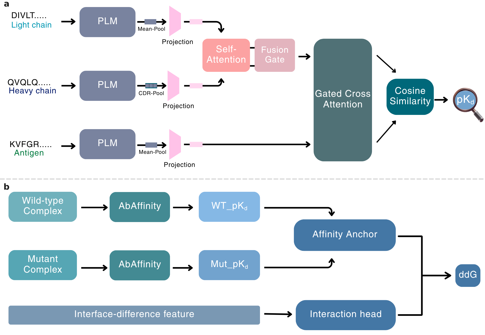

# AbAffinity-ΔΔG 

Sequence-based antibody affinity prediction requires chain-aware, antigen-dependent representations. We present AbAffinity, a chain-aware framework that transfers calibrated affinity differences to mutational effects through a lightweight correction head. AbAffinity outperforms early-fusion models on random and antigen-cold SAAINT-DB splits, reaching Pearson $r=0.84$ on the random split. On S1131, it surpasses evaluated frozen-feature and parameter-matched baselines under complex-disjoint ($r=0.71$) and antigen-disjoint ($r=0.68$) evaluation. Antigen interventions and paratope attribution support biologically plausible partner dependence. Frozen protein language model features enable sequence-only prediction with modest computational demands.




## Step-by-step: reproduce the main ddG result from scratch

1. **Install dependencies**
   ```bash
   pip install torch transformers numpy pandas scipy scikit-learn matplotlib biopython
   ```
   A CUDA GPU is strongly recommended (ESM-2 650M forward passes over S1131
   otherwise take a long time on CPU).

2. **Clone this repo** — the checkpoint (`checkpoints/model.pt`) and input
   pairs (`data/ddg_input_*.csv`) are already included, so no external
   downloads are required for this step.

3. **Train the main model** (pKd-difference anchor + gated correction head,
   3 seeds:
   ```bash
   cd ddg/
   python moe_ddg.py --mode dgsub --anchor_pkd --seeds 0 1 2 \
       --pairs_csv ../data/ddg_input_random.csv --fold_col fold_id \
       --cutoffs random
   ```
   On first run this will download ESM-2 650M (~2.5 GB, one-time,
   `facebook/esm2_t33_650M_UR50D`) and build a local token-embedding cache
   next to the input data (`data/esm2_token_cache_650M.pkl`).

4. **Reproduce the anchor-only ablation** ( "Affinity anchor only",
   ) by adding `--no_moe`:
   ```bash
   python moe_ddg.py --mode dgsub --anchor_pkd --no_moe --seeds 0 1 2 \
       --pairs_csv ../data/ddg_input_random.csv --fold_col fold_id --cutoffs random
   ```

5. **Reproduce the other anchor formulations** :
   ```bash
   # raw-cosine-difference anchor
   python moe_ddg.py --mode dgsub --seeds 0 1 2 \
       --pairs_csv ../data/ddg_input_random.csv --fold_col fold_id --cutoffs random
   # ΔG-difference anchor
   python moe_ddg.py --mode dgsub --anchor_dg --seeds 0 1 2 \
       --pairs_csv ../data/ddg_input_random.csv --fold_col fold_id --cutoffs random
   ```

6. **Run on the grouped splits** (complex-disjoint / antigen-disjoint) by
   swapping `--pairs_csv` / `--cutoffs` to the corresponding `data/ddg_input_*.csv`
   file — see `moe_ddg.py --help` for the exact fold-column/cutoff naming used
   for each split regime.

7. **Baselines** (Table S5's XGBoost / RandomForest / MLP / LSTM rows):
   ```bash
   python baselines_ddg.py --pairs_csv ../data/ddg_input_random.csv
   python neural_baselines_ddg.py --pairs_csv ../data/ddg_input_random.csv
   ```

8. **Score predictions** with bootstrap CIs:
   ```bash
   python compute_metrics_ci.py --preds <path-to-predictions.csv>
   ```

9. **Regenerate the figures** once you have prediction CSVs saved in the
   directory layout `make_ddg_master_figure.py` expects (see the script's
   `RES`/subfolder names — `anchorpkd_final/`, `anchoronly_final/`,
   `anchordg_final/`, `cosine_final/`):
   ```bash
   cd ../figures/
   python make_ddg_master_figure.py       # -> figure_ddg_results.png / .pdf
   python make_affinity_master_figure.py  # -> figure_affinity_results.png / .pdf
   ```

## Citation

Please cite the paper and the companion
absolute-affinity model:

@article{singh2026antibody,
  title={Antibody-Antigen Affinity Prediction with Chain-Aware Protein Language Modeling},
  author={Singh, Harshit and Malhotra, Aastha and Srivastava, Satya Pratik and SINGH, RAJEEV KUMAR and Gorantla, Rohan},
  journal={bioRxiv},
  pages={2026--06},
  year={2026},
  publisher={Cold Spring Harbor Laboratory}
}

> Singh, H., Malhotra, A., Srivastava, S.P., Singh, R.K., Gorantla, R.
> Antibody–antigen affinity prediction with chain-aware protein language
> modeling. *bioRxiv* (2026). doi:10.64898/2026.06.19.733375
